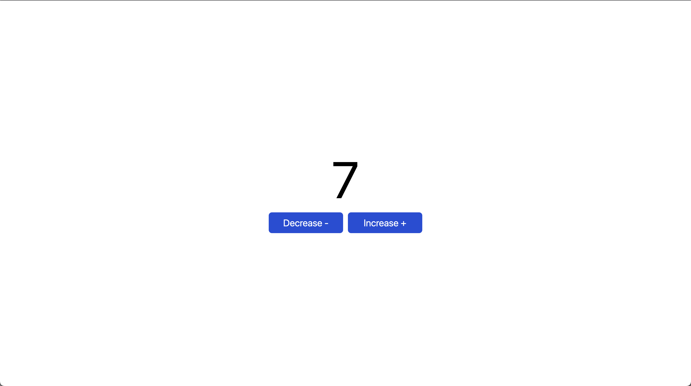

# GoLang, HTMX counter application

## features

- learn about go
- using CHi for backend routing
- learn about htmx
- implement the basics of GoLang and htmx

> <https://abdulkader-golang-htmx-counter.onrender.com>

`I am using free instance on RenderJS thats main my app will spin down with inactivity, which can delay requests by 50 seconds or more and need time to be up when entering the site`
